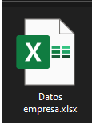
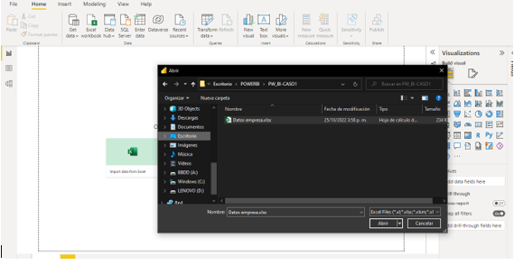
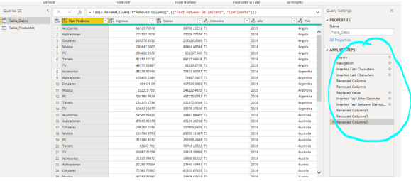
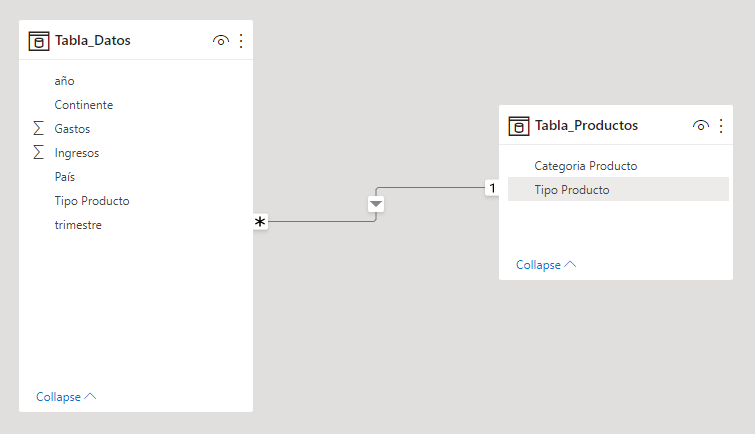
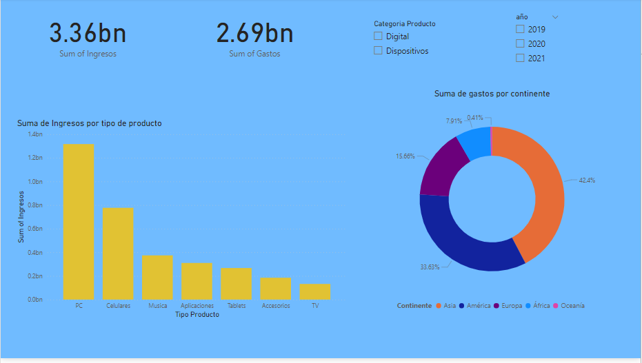

# Desarrollo de un caso con PowerBI

Hola a todos, en esta oportunidad desarrollaremos un caso práctico donde analizaremos la información de productos, gastos, ingresos , region,etc. La empresa desea tener un dashboard que permita analizar la información  de una manera sencilla y  eficiente para la toma de descisiones.

1. Teniendo en cuenta los principos del ETL.En primer lugar buscamos un nuestra fuente da datos con la que vamos a trabajar. Para este caso será con un un archivo excel.

      

2. Ahora vamos a nuestra aplicación de PowerBI y procedemos ha hacer la extración de datos desde nuestro archivo excel. 

3. Una vez cargada las informacion a PowerBI, le damos click en menú de transformar datos(Transform), pues aveces se requiere hacer cambios en la informacion. Por ejemplo indicar el tipo de dato que realmente queremos, verficar que las tablas tengan información correctamente organizada,extraer información incesaria, etc.

4. Una vez que guardamos los cambios de nuestra información(Load), procedemos a ver el modelo de relaciones de nuestras tablas y unimos los campos que permitan relacionar nuestras tablas. En la mayoría de casos buscaremos llevar nuestro modelo al modelo estrella, en este caso no es necesario ya que solo contamos con dos tablas.

5. Ya organizada nuestra información, procedemos a crear Dashboars con informacion relevante y sintetizada.
Por en ejemplo en la gráfica de muestra:

      *suma total de ingresos

      *suma total de gastos  

      *suma de ingreso por productos

      *suma de gastos por continente

      *Ademas tenemos filtros para segmentar la información segun categoría y año.
   

        Gracias por llegar aquí!!
